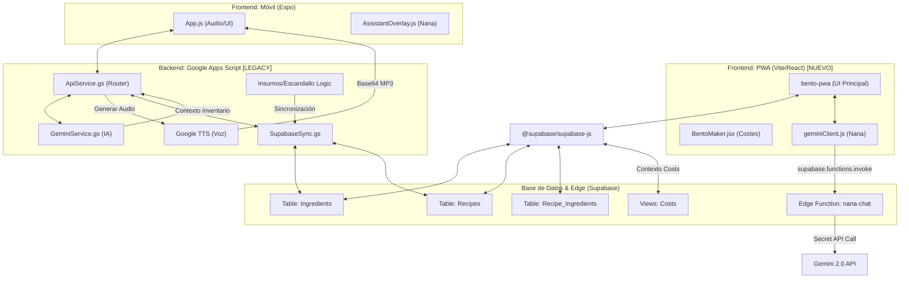

# PROJECT MAP - BaChan Bento Box

## 📊 Estructura de Conexiones

---

## 🏗️ Estructura del Proyecto

### 1. Backend: Google Apps Script
Ubicado en la carpeta `/Escandallos/AutomatizacionEscandallos/`. Gestiona la lógica de las hojas de cálculo y actúa como API para la aplicación móvil.

- **`ApiService.gs`**: 
  - Punto de entrada principal (`doGet`, `doPost`).
  - Procesa comandos del asistente y gestiona el Audio (Google TTS).
  - Contiene la lógica de transformación "Flaite" y perfiles de voz de Nana.
- **`GeminiService.gs`**: Gestión de la IA. Envía prompts, contexto de la despensa y recibe acciones (JSON).
- **`SupabaseSync.gs`**: Sincronización bidireccional entre Google Sheets y la base de datos Supabase.
- **`InsumosLogic.gs`**: Lógica de cálculo de costes por gramo en la pestaña "Insumos" y propagación automática a todas las recetas.
- **`EscandalloLogic.gs`**: Lógica de costeo dentro de las hojas de recetas individuales.
- **`Config.gs`**: Definiciones globales, constantes y configuración de columnas dinámicas.
- **`PanelControl.gs` / `ProfitabilityLogic.gs`**: Gestión del panel de rentabilidad y precios de venta.
- **`ExportLogic.gs`**: Generación de informes y exportación de recetas.

### 2. Frontend: BaChan Mobile (Expo)
Ubicado en `/bachan-mobile/`. Aplicación móvil construida con React Native y Expo.

- **`App.js`**: Lógica principal de navegación, captura de audio y comunicación con el backend de Google Apps Script.
- **`src/components/`**: 
  - `AssistantOverlay.js`: UI del asistente visual (Nana).
  - `InsumosList.js`: Visualización de ingredientes y precios.
- **`src/styles/`**: Definición del tema visual (colores corporativos).

### 3. Frontend: BaChan Bento Maker (PWA) [NUEVO]
Ubicado en `/bento-pwa/`. Aplicación web construida con React, Vite y Supabase JS. Sustituye la necesidad de usar Google Sheets para la gestión diaria.

- **`src/hooks/`**: Conexiones directas a Supabase (`useIngredients`, `useRecipes`, `useBentoMaker`).
- **`src/components/BentoMaker/`**: UI interactiva para crear escandallos con cálculo de costes y rentabilidad en tiempo real.
- **`src/lib/geminiClient.js`**: Integración directa con NANA (Gemini 2.0) desde el navegador.
- **`src/components/ImageUploader.js`**: Compresión de imágenes a WebP en el lado del cliente.

---

## ⚙️ Configuración y Variables de Entorno
El sistema utiliza `PropertiesService` (Propiedades del Script) en Google Apps Script para almacenar datos sensibles y configuraciones de voz:

| Propiedad | Descripción |
| :--- | :--- |
| `GEMINI_API_KEY` | Clave para el cerebro de la IA. |
| `SUPABASE_URL` / `KEY` | Conexión con la base de datos externa. |
| `GOOGLE_TTS_KEY` | Clave para la síntesis de voz. |
| `NANA_VOICE_NAME` | Nombre del modelo de voz actual. |
| `NANA_VOICE_PITCH` / `RATE` | Ajustes de tono y velocidad. |
| `NANA_SLANG_MODE` | Estado del transformador de lenguaje ("true"/"false"). |

---

## 🔄 Flujo de Datos Principal
1. **App Móvil** envía texto/audio -> `doPost` en `ApiService.gs`.
2. `ApiService` llama a `GeminiService` con el contexto de la despensa.
3. `Gemini` devuelve una respuesta + **ACCION (JSON)**.
4. `ApiService` ejecuta la acción (ej: Actualizar precio en Supabase).
5. Se genera el audio (con o sin slang) y se devuelve a la App.
